# 🧠 Brain Tumor Classification using ConvNeXt-Base + EfficientNet-B4 + CBAM

A Hybrid Deep Learning Model for **Multi-Class Brain Tumor Classification** using **ConvNeXt-Base**, **EfficientNet-B4**, and the **Convolutional Block Attention Module (CBAM)** built with **TensorFlow** and **Keras**.

The proposed architecture combines two powerful CNN backbones with an attention mechanism to improve feature extraction and accurately classify brain MRI images into four tumor categories.

---

# 📌 Features

- Hybrid Deep Learning Architecture
- ConvNeXt-Base Backbone
- EfficientNet-B4 Backbone
- CBAM Attention Module
- Feature Fusion
- TensorFlow & Keras Implementation
- Multi-Class Brain Tumor Classification
- High Validation Accuracy
- ROC Analysis
- Confusion Matrix
- Per-Class Metrics
- Model Comparison

---

# 📂 Dataset

This project uses the **Brain Tumor MRI Dataset** available on Kaggle.

### Dataset Link

https://www.kaggle.com/datasets/masoudnickparvar/brain-tumor-mri-dataset

### Classes

- Glioma
- Meningioma
- Pituitary
- No Tumor

### Dataset Structure

```text
dataset/
│
├── Training/
│   ├── glioma/
│   ├── meningioma/
│   ├── pituitary/
│   └── notumor/
│
└── Testing/
    ├── glioma/
    ├── meningioma/
    ├── pituitary/
    └── notumor/
```

---

# 🖼 Dataset Samples

<p align="center">
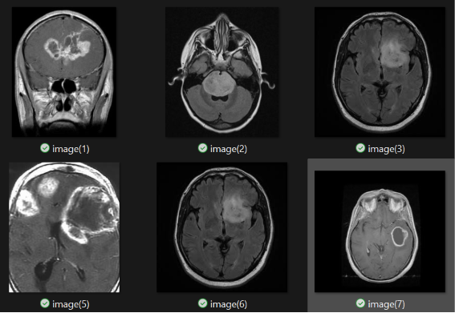
</p>

---

# ⚙ Data Preprocessing

The preprocessing pipeline includes:

- Image Resizing
- Pixel Normalization
- Label Encoding
- Data Shuffling
- Train / Validation Split
- Batch Generation
- Data Augmentation


---

# 🏗 Hybrid Model Architecture

The proposed architecture consists of three major components.

## ConvNeXt-Base

Extracts deep hierarchical image features.

## EfficientNet-B4

Provides efficient feature extraction using compound scaling.

## CBAM

The Convolutional Block Attention Module enhances features through

- Channel Attention
- Spatial Attention

Finally, features from both networks are fused before classification.

---

# 🧠 Proposed Architecture

<p align="center">
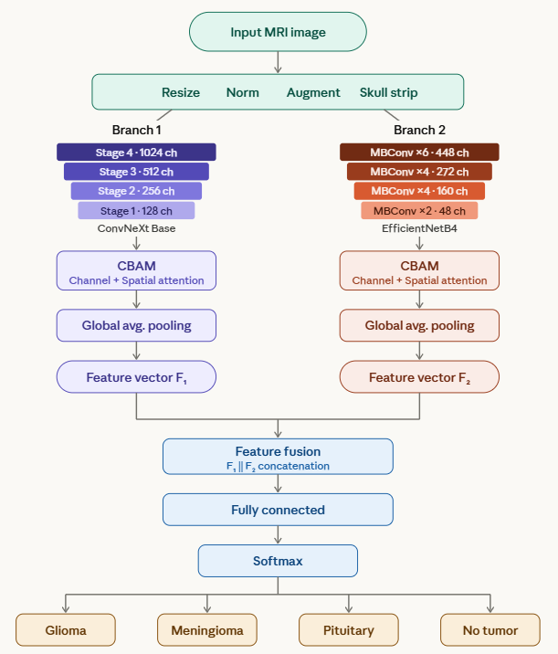
</p>

### Pipeline

```text
MRI Image
      │
      ▼
───────────────
ConvNeXt-Base
───────────────
      │
───────────────
EfficientNet-B4
───────────────
      │
 Feature Fusion
      │
      CBAM
      │
Global Average Pooling
      │
 Dense Layer
      │
 Dropout
      │
 Softmax
      │
Predicted Class
```

---

# 🚀 Training Configuration

### Framework

- TensorFlow
- Keras

### Optimizer

Adam

### Loss Function

Categorical Crossentropy

### Callbacks

- EarlyStopping
- ModelCheckpoint
- ReduceLROnPlateau

### Metrics

- Accuracy
- Precision
- Recall
- F1 Score

---

# 📈 Training Curves

## Accuracy Curve

<p align="center">
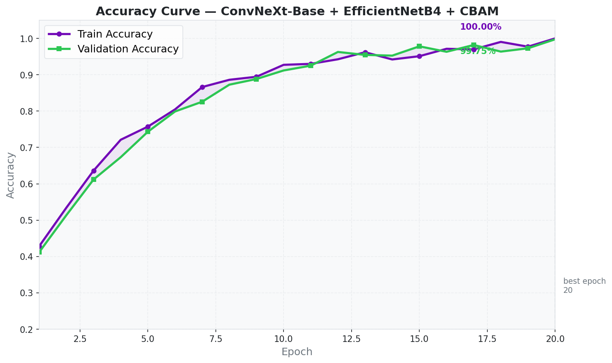
</p>

---

## Loss Curve

<p align="center">
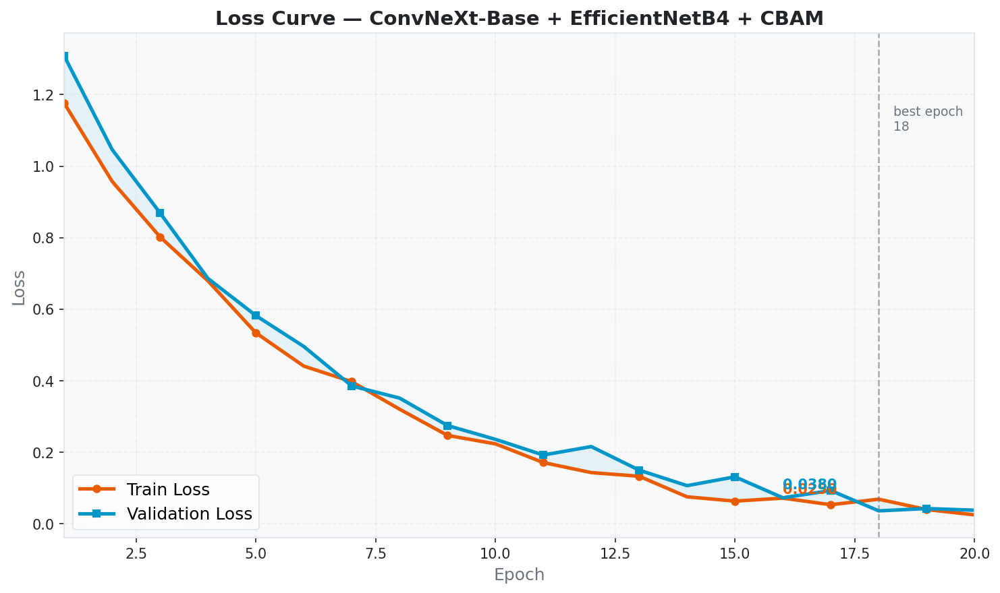
</p>

---

# 📊 Performance

| Dataset | Accuracy | Precision | Recall | F1-Score |
|----------|----------|-----------|---------|----------|
| Validation | **99.75%** | **99.75%** | **99.75%** | **99.75%** |
| Test | **95.58%** | **95.93%** | **95.58%** | **95.50%** |

---

# 🔥 Validation Confusion Matrix

<p align="center">
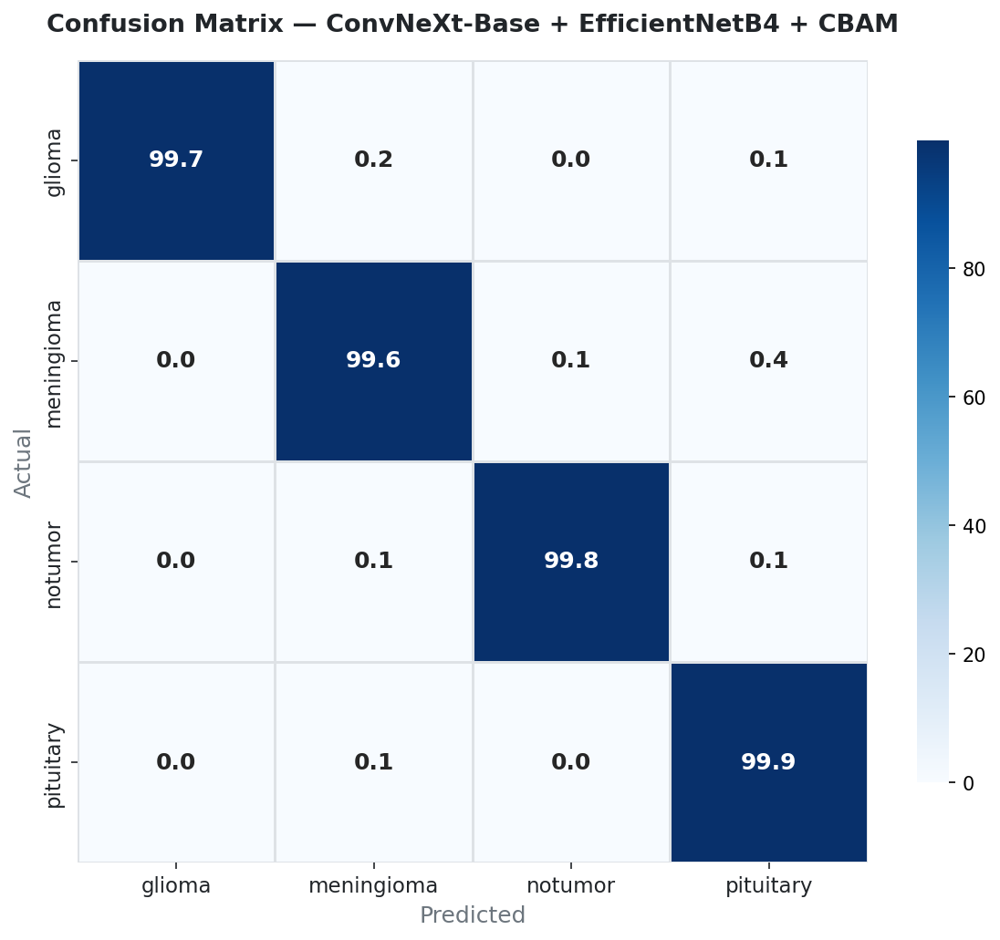
</p>

---

# 🧪 Test Confusion Matrix

<p align="center">
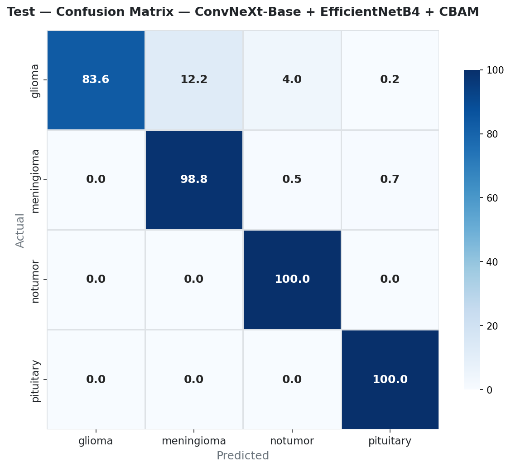
</p>

---

# 📋 Per-Class Metrics

The following figure illustrates Precision, Recall and F1-score for every tumor category.

<p align="center">
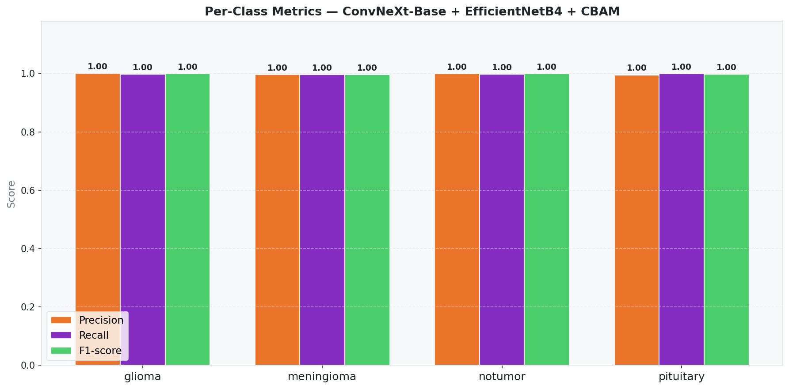
</p>

---

# 📈 Validation ROC Curves

<p align="center">
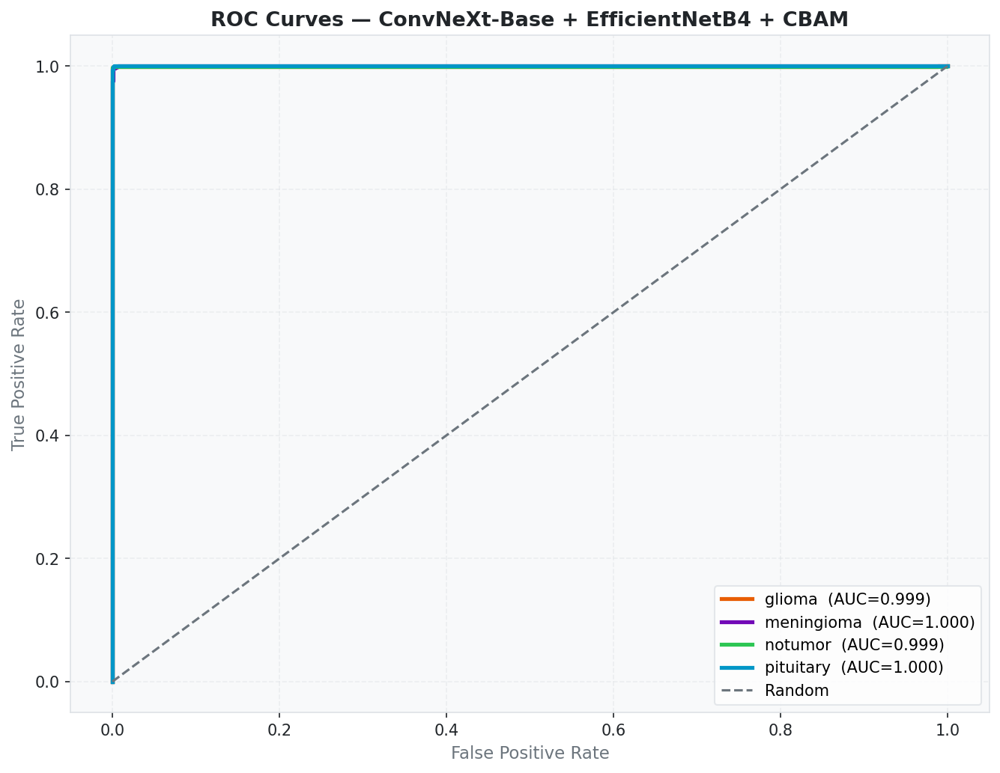
</p>

---

# 📈 Test ROC Curves

<p align="center">
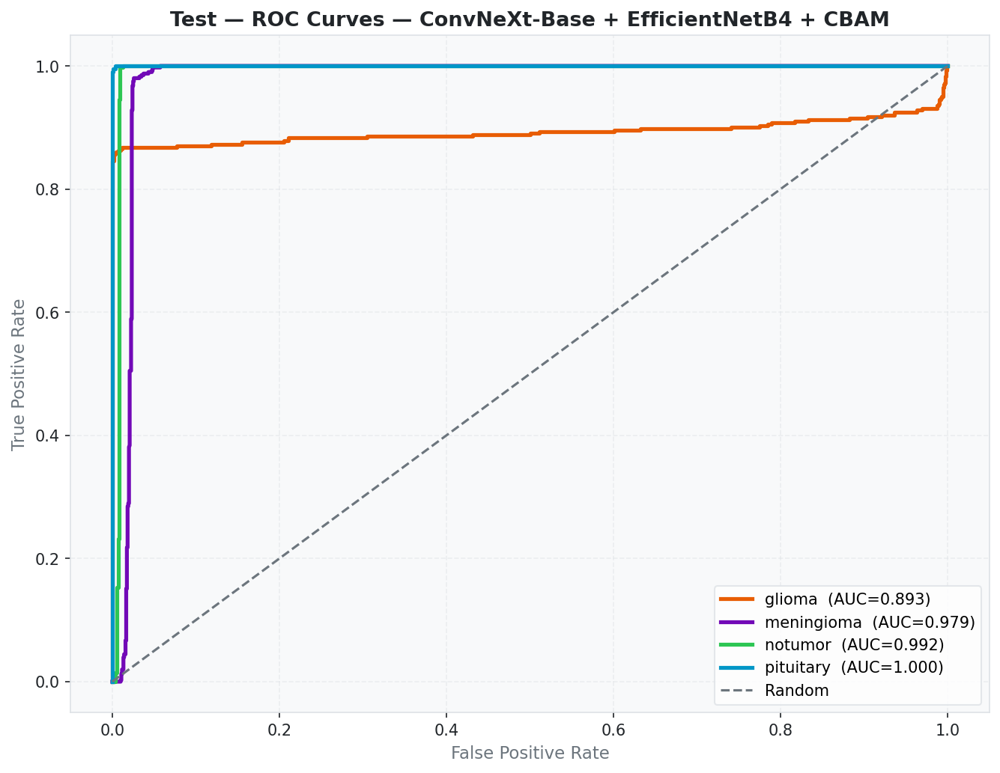
</p>

---

# 📊 Comparison with Existing Models

The proposed hybrid architecture outperforms several well-known CNN models.

<p align="center">
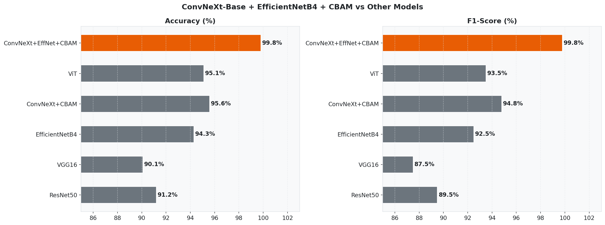
</p>

---

# 📡 Final Performance Radar Chart

<p align="center">
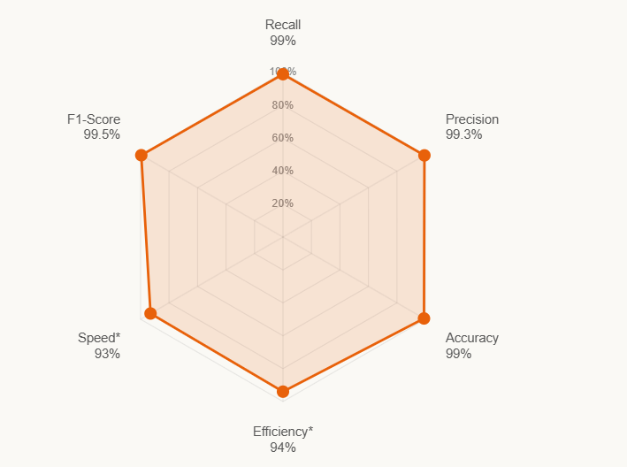
</p>

---

# 📁 Repository Structure

```text
Brain-Tumor-Classification/
│
├── dataset/
│
├── images/
│   ├── dataset.png
│   ├── preprocessing.png
│   ├── model_architecture.png
│   ├── 01a_accuracy_curve.png
│   ├── 01b_loss_curve.png
│   ├── 02_confusion_matrix.png
│   ├── 02_confusion_matrix_test.png
│   ├── 03_per_class_metrics.png
│   ├── 04_roc_curves.png
│   ├── 04_roc_curves_test.png
│   ├── 05_radar_metrics.png
│   ├── 06_model_comparison.png
│   └── rader.png
│
├── models/
│
├── Brain_Tumor_Classification.ipynb
│
├── requirements.txt
│
└── README.md
```

---

# 💻 Requirements

```text
tensorflow
keras
numpy
pandas
matplotlib
opencv-python
scikit-learn
Pillow
```

Install dependencies

```bash
pip install -r requirements.txt
```

---

# ▶️ Run the Project

Using Jupyter Notebook

```bash
jupyter notebook Brain_Tumor_Classification.ipynb
```

or

```bash
python train.py
```

---

# 🛠 Technologies Used

- Python
- TensorFlow
- Keras
- ConvNeXt-Base
- EfficientNet-B4
- CBAM
- NumPy
- Pandas
- OpenCV
- Matplotlib
- Scikit-learn

---

# 📚 References

- Brain Tumor MRI Dataset (Kaggle)
- TensorFlow Documentation
- Keras Documentation
- ConvNeXt Research Paper
- EfficientNet Research Paper
- CBAM Research Paper

---

# 🤝 Contributing

Contributions are welcome.

1. Fork the repository.
2. Create a new branch.
3. Commit your changes.
4. Push the branch.
5. Open a Pull Request.

---

# ⭐ Support

If you found this project useful, please consider giving this repository a **⭐ Star**.

It helps others discover the project and supports future development.

---
